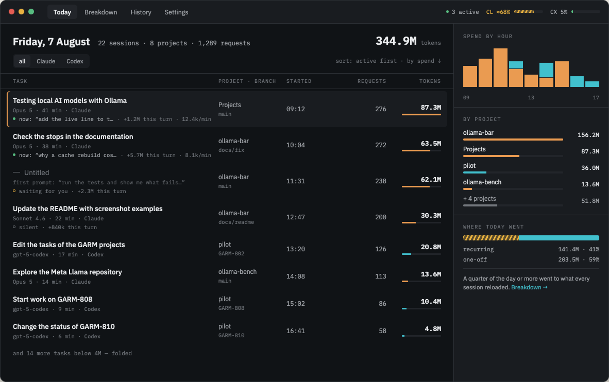
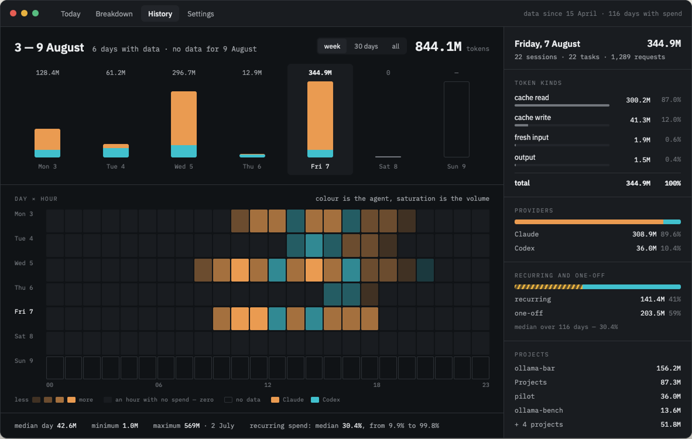

# Agentmeter

A token meter for coding agents — Claude Code and Codex. It lives in the tray,
shows who is working right now, how much is left before you hit a limit, and
where the day went. Everything is computed from the logs already on your disk:
sessions, tasks, tools, MCP servers, skills and subagents.

The question it was written to answer is **what your setup costs when you are
not using it**. An MCP server you never called still loads into every session
and is re-read on every request; on real logs 19 servers out of 22 turned out
to be never called, and they cost 11.4M tokens.



## What it shows

- **Who is working right now** — the tray popup: agent, project, state
  (thinking, waiting for you, silent), pace in tokens per minute, and how much
  of the context window is left.
- **Limits** — the 5-hour and weekly windows. Codex reports exact percentages
  from the server; Claude's are marked with `≈` (see “What it does not know”).
- **The whole day** — a feed of tasks with an expandable card: request
  timeline, token kinds, tools, files touched, subagents. Plus breakdowns by
  hour, project and ticket. Sessions that are running right now are pinned to
  the top of the feed with what they are working on: the request itself, what
  the turn has cost so far, and the pace.
- **Where the spend went** — what sits in the prompt before your first word
  versus what the agent actually called, with advice like “the jira server was
  never called across 34 sessions; turning it off returns 194.7k”.
- **History** — a calendar week, 30 days or all time, with a day × hour heatmap.

The popup is shown at its real size — 400 × 600, right under the tray icon:


The screens above are rendered from the project's design reference with the
app's English wording — the same strings the interface itself uses. The app
ships with **both English and Russian** and follows your system language by
default; the same six screens in Russian are in
[`docs/screenshots/ru/`](docs/screenshots/ru/).

## Install

Builds live on the [releases page](https://github.com/fosteev/Agentmeter/releases):
`.dmg` for macOS, `.exe` for Windows, `.AppImage` and `.deb` for Linux.

**The builds are not signed yet.** That is the honest state of things, not a
forgotten checkbox: signing is a separate stage and the project has no
certificates yet. In practice:

- **macOS** will say the app “cannot be opened because the developer cannot be
  verified”. Right-click the app → “Open” → “Open” in the dialog. Or once, in a
  terminal: `xattr -dr com.apple.quarantine /Applications/Agentmeter.app`.
- **Windows** shows the blue SmartScreen prompt: “More info” → “Run anyway”.
- **Linux** asks nothing. Remember `chmod +x` for the `.AppImage`.

## What it does with your data

Nothing leaves your machine unless you ask it to. Logs are read from disk,
parsed locally and kept in a SQLite index inside the app's config directory.

**There are exactly two network calls, and both are switches you control.**

1. **The update check** — every six hours, against this repository's releases.
   On by default, turned off in Settings → Application.
2. **Asking Anthropic for your limit percentages** — **off by default**, turned
   on in Settings → Limits. When on, the app reads your existing Claude Code
   token (from `~/.claude/.credentials.json` or the macOS keychain) and asks
   `api.anthropic.com` how much of your 5-hour and weekly windows you have used,
   at most once every fifteen minutes. Nothing else is sent, nothing is written
   back: the app never refreshes or rewrites your credentials, and your token is
   never logged or shown on screen.

Why the second one exists: Claude does not write the limit percentage into its
logs at all. The status line hook (Settings → Limits) gets it without any
network — but the status line only exists in the terminal, so in VS Code and
other editors there is nothing to hook. Asking directly is the only way to know
the real number there, which is why it is offered — and why you have to say yes
first.

Two privacy switches are there as well: “hide prompt texts” and “hide file
paths”. Both remove data **from the app's response**, not from the markup — a
hidden prompt never travels to the window at all.

## What it does not know — and says so

This is a measuring instrument, so anything unmeasured is marked rather than
smoothed over. Everything that is an estimate carries an `≈`.

- **Some API requests are never written to the transcript.** They are
  reconstructed from the break in the cache chain; what remains are trailing
  warm-ups after the last answer, which leave no trace at all. Such sessions are
  marked `≈`, the gap is ≤ 3.3% and always downward.
- **The weight of a cache-read token against the Claude subscription limit is
  unknown.** The difference between counting it and ignoring it is two orders of
  magnitude, so Claude percentages stay marked as estimates until they are
  calibrated by hand against `/usage`. Codex percentages come from the server
  and are exact.
- **Claude's housekeeping Haiku calls** (session titles, “while you were away”
  summaries) are absent from transcripts entirely. Against Claude Code's own
  numbers that is 1.3% of the spend overall — but up to 30% on small projects,
  because the cost is per session rather than per token. Putting a number on
  them would mean inventing a coefficient.
- **Claude Code deletes its own transcripts** (`cleanupPeriodDays`, 30 days by
  default). The index outlives them and forgets nothing, but for days *before*
  the oldest surviving log the spend is shown as a lower bound with `≈`, and
  days with no records at all read “no data” rather than “no work”.
- **Claude does not log its context window size.** It is inferred from
  observations and marked as an estimate; Codex reports it on every request.



## Command line

The same numbers without the graphics, on top of the same core:

```bash
agentmeter today                     # day total, breakdowns, limits
agentmeter tasks --day 2026-08-10    # task feed
agentmeter breakdown --by server     # breakdown: tools, MCP, skills
agentmeter limits                    # limit windows
agentmeter doctor                    # what was read, what was not understood
agentmeter export --grain task       # export to CSV or JSON
```

## Building from source

Node 22.12 or newer.

```bash
npm ci
npm run check                                  # lint, build, tests
npm run -w @agentmeter/desktop start           # run from the tray
npm run -w @agentmeter/desktop package         # build the installers
```

There are no native modules: SQLite comes from `node:sqlite`, which ships
inside Electron itself — so `electron-rebuild` is not needed and never runs.

## How it is put together

The core (`packages/core`) knows nothing about Electron: log parsing, the
index, attribution, limits and the screen aggregates all live there, and the
CLI and the app are two consumers of it. That way the numbers can be checked in
a terminal without starting a GUI.

What is in the logs, how the spend is computed and why — in
[`docs/plan.md`](docs/plan.md) and [`CLAUDE.md`](CLAUDE.md) (both in Russian).
Milestones and status live in [`docs/roadmap.md`](docs/roadmap.md).

## License

MIT — [`LICENSE`](LICENSE).
