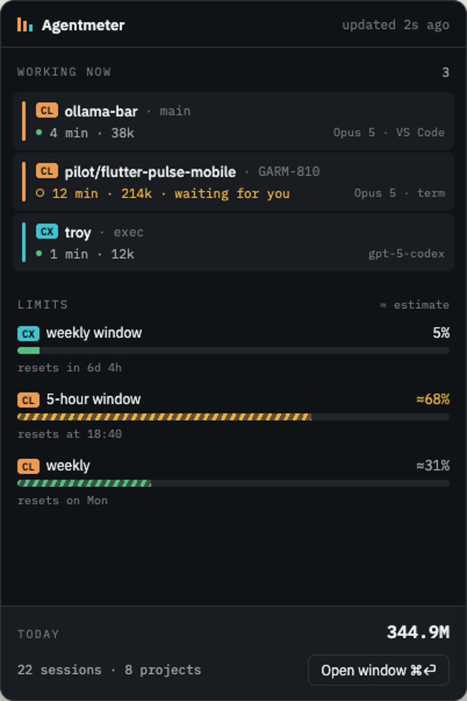
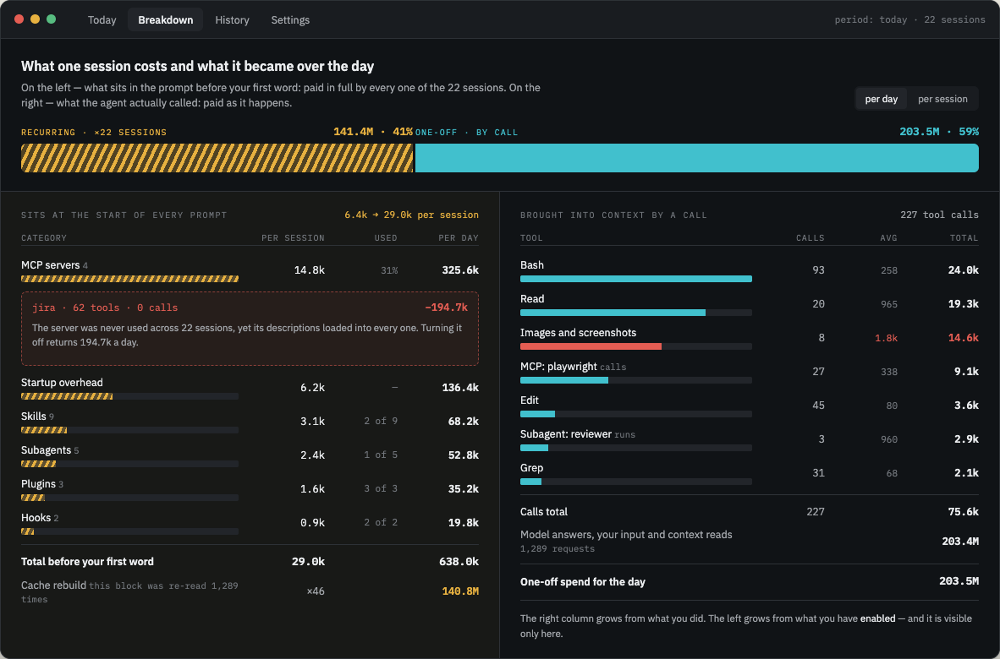

# Agentmeter

Счётчик токенов для кодинг-агентов — Claude Code и Codex. Живёт в трее,
показывает, кто работает прямо сейчас, сколько осталось до упора в лимит и на
что ушёл день. Всё считается из логов на диске: сессии, задачи, инструменты,
MCP-серверы, скиллы и сабагенты.

Главный вопрос, ради которого он написан, — **сколько стоит то, что просто
включено**. Сервер MCP, который вы не звали ни разу, всё равно грузится в
каждую сессию и перечитывается на каждом запросе; на живых логах таких серверов
нашлось 19 из 22, и стоили они 11.4M токенов.



## Что он показывает

- **Кто работает сейчас** — попап из трея: агент, проект, состояние (думает,
  ждёт ответа, молчит), темп в токенах в минуту, остаток контекстного окна.
- **Лимиты** — пятичасовое и недельное окно. У Codex проценты точные, они
  приходят от сервера; у Claude помечены знаком `≈` (см. «Чего он не знает»).
- **День целиком** — лента задач с раскрывающейся карточкой: таймлайн запросов,
  виды токенов, инструменты, затронутые файлы, сабагенты. Разрезы по часам,
  проектам и тикетам.
- **Развёртку расхода** — что лежит в промпте до вашего первого слова и что
  агент реально вызывал, с советами вида «сервер jira не звали ни разу за 34
  сессии, выключение вернёт 194.7k».
- **Историю** — календарная неделя, 30 дней или всё время, с хитмапом
  «день × час».



## Установка

Сборки лежат на [странице релизов](https://github.com/fosteev/Agentmeter/releases):
`.dmg` для macOS, `.exe` для Windows, `.AppImage` и `.deb` для Linux.

**Сборки пока не подписаны.** Это честное состояние, а не забытая галочка:
подпись — этап 5.2, сертификатов у проекта ещё нет. Что это значит на практике:

- **macOS** скажет «программу невозможно открыть, так как её автор не может
  быть подтверждён». Открыть можно так: правый клик по приложению → «Открыть» →
  «Открыть» в диалоге. Либо один раз в терминале:
  `xattr -dr com.apple.quarantine /Applications/Agentmeter.app`.
- **Windows** покажет синее окно SmartScreen: «Подробнее» → «Выполнить в любом
  случае».
- **Linux** ничего не спросит. Для `.AppImage` не забудьте `chmod +x`.

## Что он делает с вашими данными

Ничего не отправляет. Логи читаются с диска, разбираются локально и лежат в
SQLite-индексе в каталоге настроек приложения.

**Единственный сетевой вызов — проверка обновлений** (раз в шесть часов, к
релизам этого репозитория). Выключается в «Настройки → Приложение».

В настройках есть два переключателя приватности: «скрыть тексты промптов» и
«скрыть пути к файлам». Оба убирают данные **из ответа** приложения, а не из
разметки: спрятанный текст не уезжает в окно вовсе.

## Чего он не знает — и говорит об этом

Продукт измерительный, поэтому неизмеренное помечено, а не заглажено. Всё, что
оценка, показано со знаком `≈`.

- **Часть запросов к API в транскрипт не пишется.** Они восстанавливаются по
  разрыву цепочки кэша; остаток — хвостовые прогревы после последнего ответа,
  следа они не оставляют. Такие сессии помечены `≈`, расхождение ≤ 3.3% и
  всегда в меньшую сторону.
- **Вес прочитанного из кэша токена в лимите подписки Claude неизвестен.**
  Разница между «считать» и «не считать» — два порядка, поэтому проценты
  Claude помечены оценкой до ручной калибровки по `/usage`. У Codex проценты
  приходят от сервера и точны.
- **Служебные вызовы Haiku** (заголовки сессий, сводки «пока вас не было») в
  транскриптах отсутствуют вовсе. В эталоне это 1.3% расхода в целом, но до 30%
  на маленьких проектах: цена стоит по разу на сессию, а не по проценту от
  работы. Оценивать их числом значило бы придумать коэффициент.
- **Claude Code удаляет свои транскрипты сам** (`cleanupPeriodDays`, по
  умолчанию 30 суток). Индекс их переживает и ничего не забывает, но за сутки
  **до** первого уцелевшего лога расход показан нижней границей со знаком `≈`,
  а сутки без записей — «данных нет», а не «работы не было».
- **Размер контекстного окна Claude в логи не пишется.** Он выведен из
  наблюдений и помечен оценкой; у Codex он приходит в каждом запросе.

## Командная строка

Те же цифры без графики — поверх того же ядра:

```bash
agentmeter today                     # итог дня, разрезы, лимиты
agentmeter tasks --day 2026-08-10    # лента задач
agentmeter breakdown --by server     # развёртка: инструменты, MCP, скиллы
agentmeter limits                    # окна лимитов
agentmeter doctor                    # что прочитано, что не понято, калибровка
agentmeter export --grain task       # выгрузка в CSV или JSON
```

## Сборка из исходников

Нужна Node 22.12 или новее.

```bash
npm ci
npm run check                                  # линт, сборка, тесты
npm run -w @agentmeter/desktop start           # запустить из трея
npm run -w @agentmeter/desktop package         # собрать инсталляторы
```

Нативных модулей нет: SQLite берётся из `node:sqlite`, который есть в самом
Electron, — поэтому `electron-rebuild` не нужен и в упаковку не поедет.

## Как это устроено

Ядро (`packages/core`) не знает про Electron: разбор логов, индекс, атрибуция,
лимиты и агрегаты живут там, а CLI и приложение — два его потребителя. Так
цифры проверяются в терминале, не запуская GUI.

Что лежит в логах, как считается расход и почему именно так — в
[`docs/plan.md`](docs/plan.md) и [`CLAUDE.md`](CLAUDE.md). Вехи и статусы — в
[`docs/roadmap.md`](docs/roadmap.md).

## Лицензия

MIT — [`LICENSE`](LICENSE).
